# FaceMask-Detection system using YOLOv3 in Keras

First of all, I must mention that this code used in this project originally is not mine. I was inspired by [qqwweee/keras-yolo3](https://github.com/qqwweee/keras-yolo3), he wrote this code to train custom YOLOv3 Keras model.

Few changes are:
1. To load images for detection, replaced PIL with opencv.
2. Used the same opencv font for drawing text on detected images.
3. Wrote seperate detection script for images and videos.

# Dependencies :
- Python 3.6.10
- Keras 2.2.4 `conda install keras=2.2.4`
- Tensorflow 1.15 `conda install tensorflow-gpu=1.15` or `conda install tensorflow`
- OpenCV-python
- PIL
- NumPy
- Moviepy(for the detection of videos)  `pip install moviepy`
- LabelImg

Note that keras and tensorflow have their own dependencies. I recommend using [Anaconda](https://www.anaconda.com/) for handlinng the packages.

# Dataset :
I created the dataset for this project. It is divided into two categories ie "with_face_mask" and "without_face_mask". I downloaded the images for both categories from internet and saved them in respective folder in the local disk.

The most important part is the creation of Annotations and bounding boxes; for that purpose I used the [LabelImg](https://github.com/tzutalin/labelImg) annotation tool and created the labels and bounding boxes for each image.

In LabelImg, the annotations files are available in two format ie VOC format(XML file) or YOLO format. So, I got the data annotation file in YOLO format directly from labelImg ie [dataset_train.txt](YOLOv3/dataset_train.txt) file.

# Usage :
- Either download YOLOv3 weights from [YOLO website](https://pjreddie.com/media/files/yolov3.weights) & convert them, or download the YOLOv3 weights in keras format from [release section](https://github.com/vijayg15/FaceMask-Detection/releases/tag/yolo_weights).\
Copy downloaded weights file to "model_data" folder.
- Run the "train.py" file for training the model. (I opt batch_size = 4, increase the batch_size if have more memory). \
I tried to train with GTX1650, received memory error while using "batch_size = 32 or 16", was able to train with 4. \
Increase epochs count for better model accuracy.
- After finishing training, in "trained_weights/003/" folder there should be created new "trained_weights_final.h5" model file. \
This will be used for custom detection.
- Test YOLOv3 with images, use "image_detect.py" \
Simply change "model_path" and "classes_path", to the used files. Then at the end of file, change the test image name and directory.
- Test YOLOv3 with videos, use "video_detect.py" \
Simply change "model_path" and "classes_path", to the used files. Then at the end of file, just change the video and video_output directory.

# Screenshots :
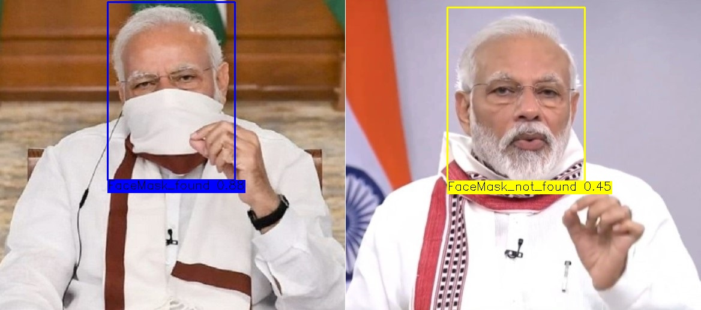
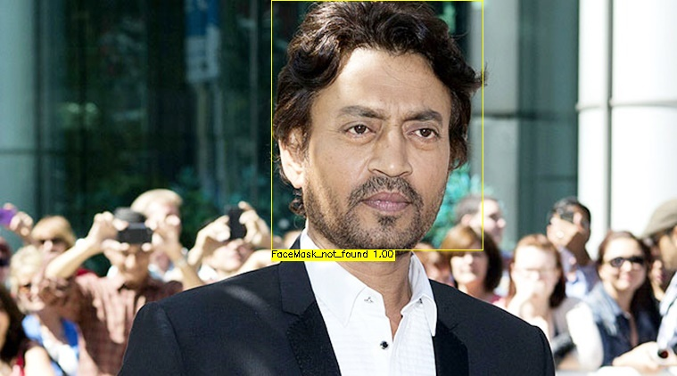

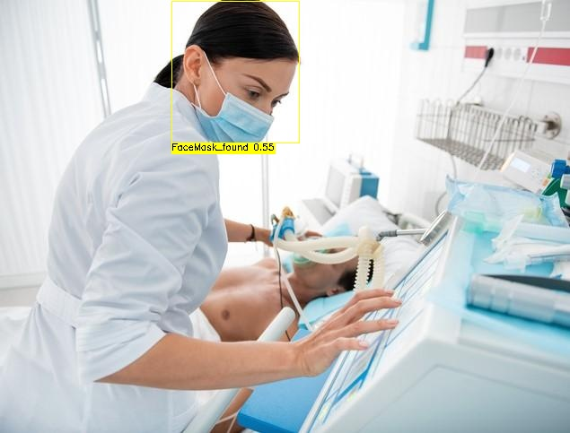
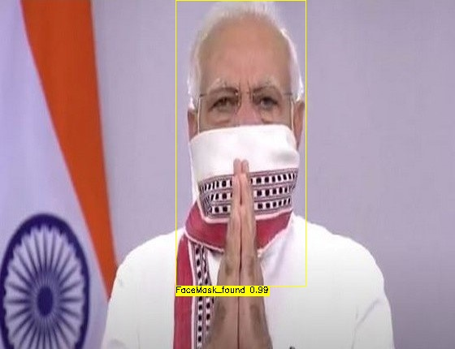

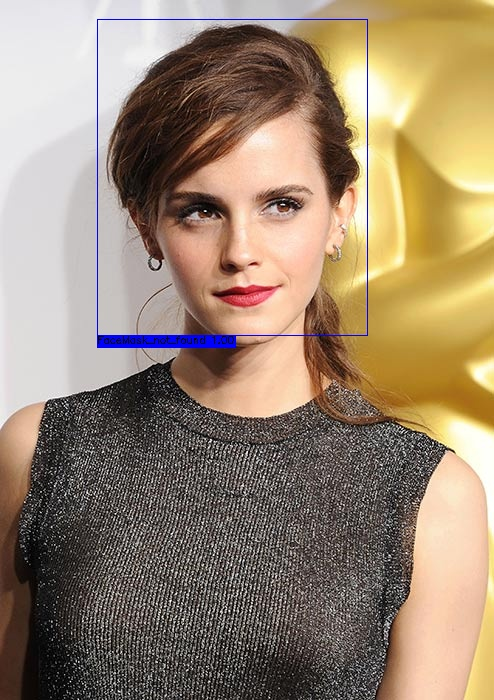
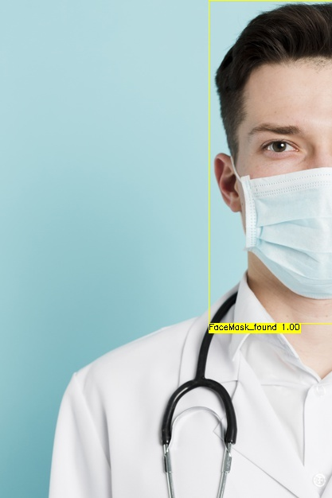
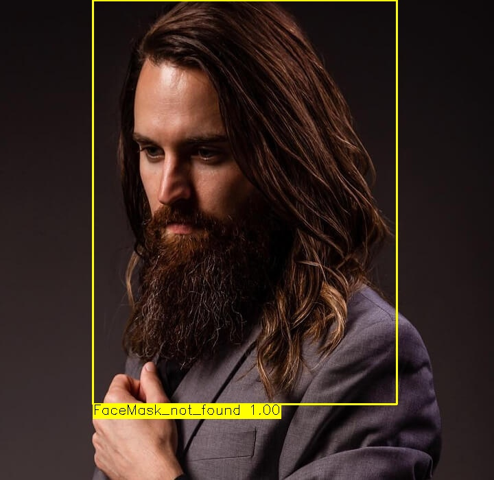

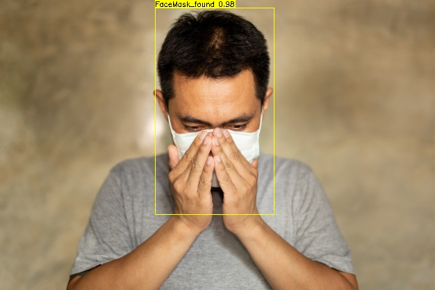

 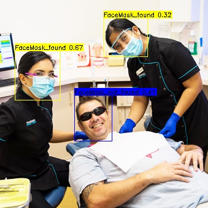 
  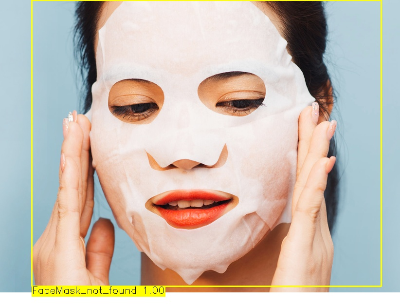 

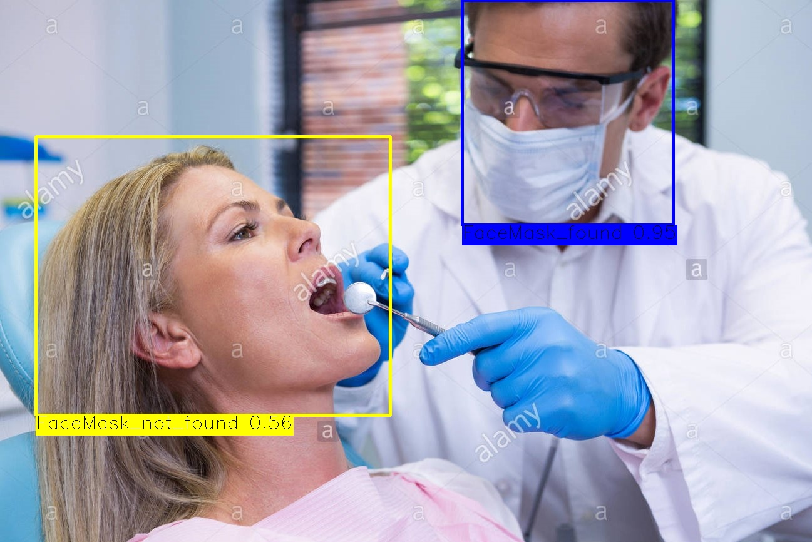
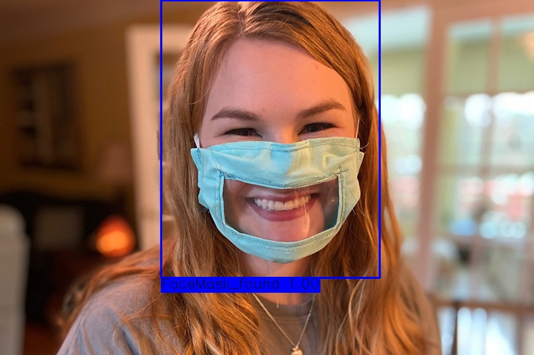
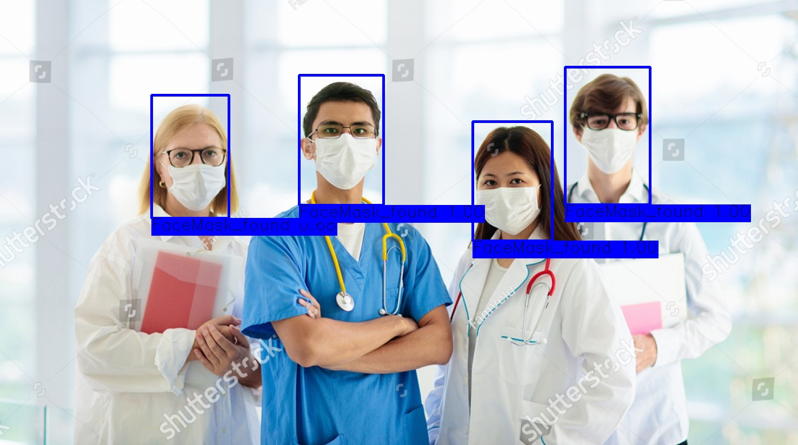
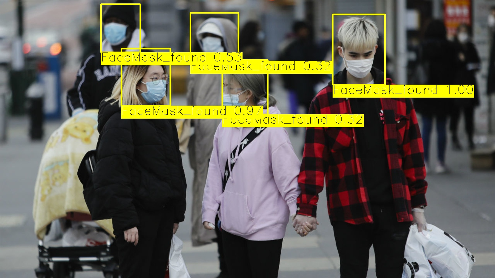
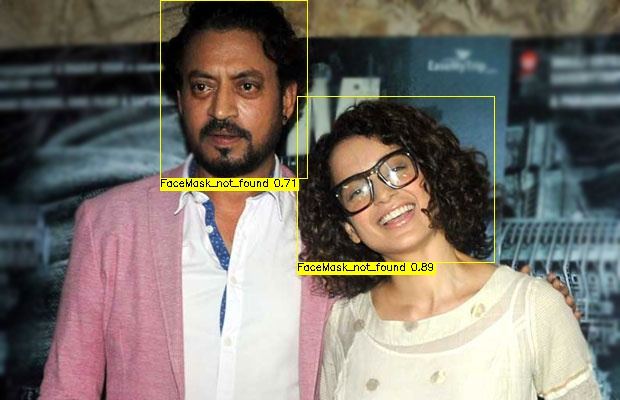
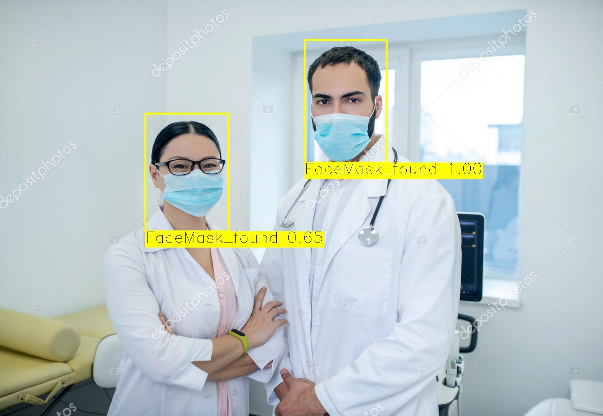
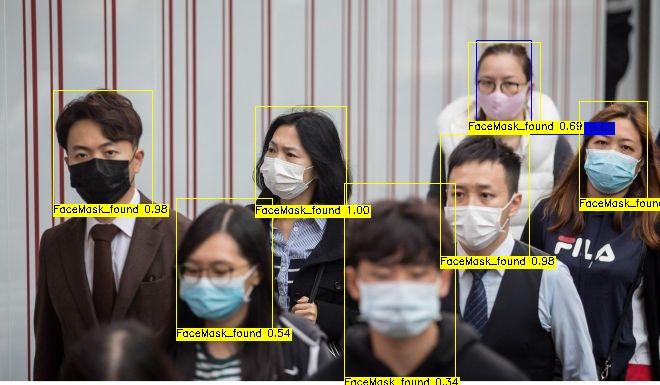
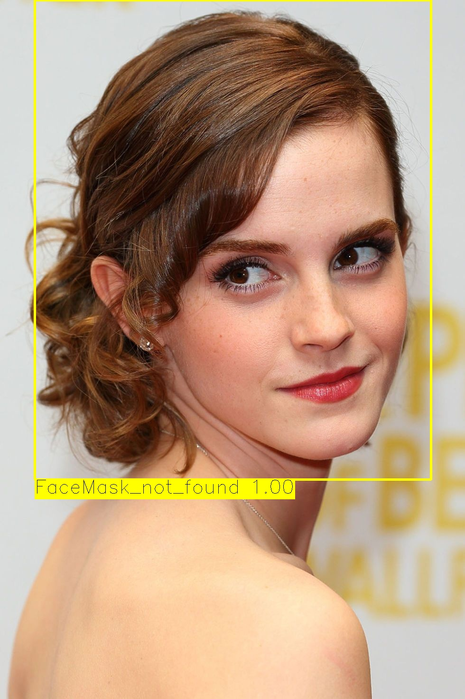

# Video
#### I've also checked the final model on a video file. The output file can be seen [here](https://github.com/vijayg15/FaceMask-Detection/blob/master/Dataset/test/video1_output.mp4).
  
